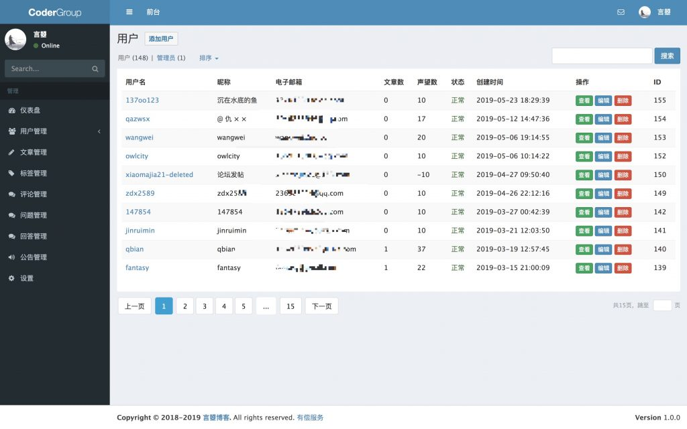
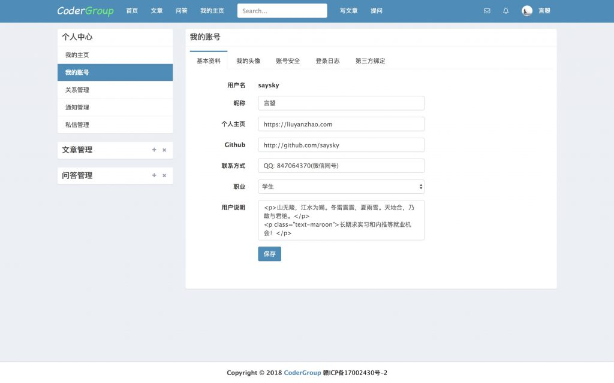

# 关于项目
本站基于 SpringBoot + SpringData JPA +Thymeleaf 实现，MySQL数据库。 
引入Spring Security作为权限框架，Redis 作为部分缓存。 
前端采用 BootStrap + jQuery 实现。 
详细介绍：https://liuyanzhao.com/8402.html   

# 功能介绍
文章、分类、标签、评论、点赞、收藏、提问、回答、评论点赞   
注册、登录、找回密码(邮件发送)  
两种角色，管理员和普通用户（可以扩展）  
七牛云上传  
第三方登录(QQ登录和GitHub登录)  
等等   

# 页面预览

# 关于开源
目前仅开源了后端代码，您可以学习SpringBoot，Spring Security, Spring Data JPA, Redis等常见用法。  
同时，这个项目时启动不起来的，所以说只适合阅读代码。  
如果您需要完整版代码，请联系博主：847064370(QQ和微信)。

## 请喝一杯奶茶
请我喝一杯奶茶吧！  
插条广告：博主最近有点时间，长期接毕设定制，软件定制，Java问题解决  
具体查看[有偿服务](https://liuyanzhao.com/bulletin/my-service)

